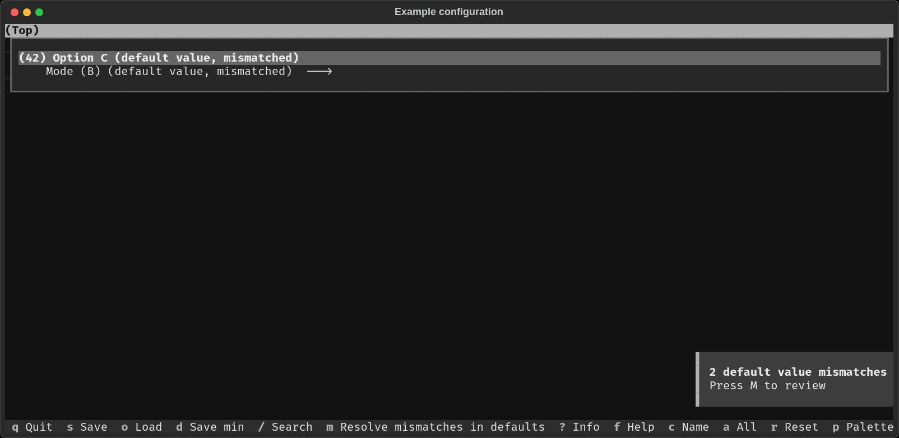
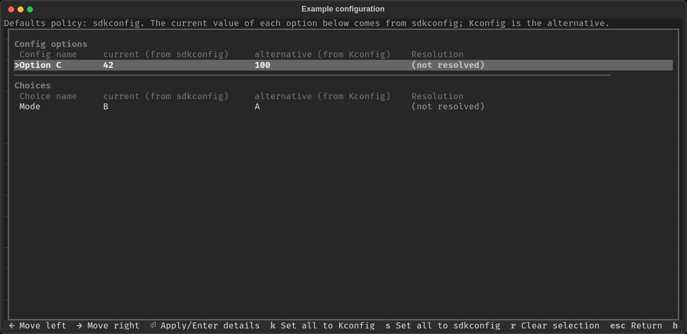
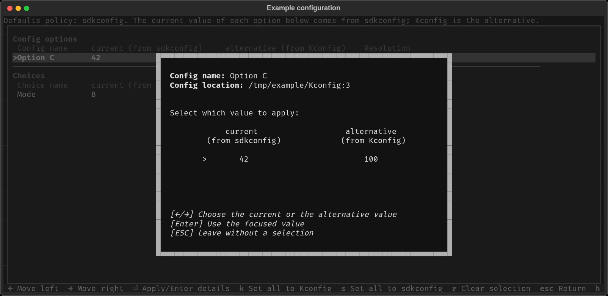

.. _defaults:

Default Values and Their Inference
==================================

In original ``kconfiglib``, when the configuration was written out to e.g. ``sdkconfig`` file, all the values were considered user-set, no matter if the user actually set them (even indirectly via e.g. ``sdkconfig.defaults``). This behavior resulted in rather confusing situations; when e.g. conditional default values were not updated if the condition was changed.

.. note::

    This note is intended primarily for component maintainers.

    The information below applies only to configuration options that have a prompt. Promptless config options have different value inference. When loading ``sdkconfig[.defaults]`` files, the values for promptless config options are **always ignored** (their value is always set to the **Kconfig default value**). These config options are also hidden in configuration tools, such as ``menuconfig``, and cannot be changed by the user.

Consider the following example:

.. code-block:: kconfig

    # Kconfig file

    config A
        bool "Option A"
        default y

    config B
        int "Option B"
        default 42 if A
        default 0 if !A

.. code-block:: kconfig

    # sdkconfig file
    # Let's suppose both values were not set by the user, but rather automatically inferred
    CONFIG_A=y
    CONFIG_B=42

If a user runs ``menuconfig`` and changes the value of ``CONFIG_A`` to "n", ``CONFIG_B`` would still be set to 42, even though, based on the Kconfig file, it should be 0. This is because the value of ``CONFIG_B`` was considered user-set, even though it was not. To fix this behavior, the inference of default values was reworked in ``esp-idf-kconfig``. During writeout of the ``sdkconfig`` file, the configuration system now distinguishes between user-set and inferred (default) values. Default values have a ``# default:`` comment/pragma preceding the given line:

.. code-block:: kconfig

    # sdkconfig file. Explicitly stated that both values are default.
    # default:
    CONFIG_A=y
    # default:
    CONFIG_B=42

The configuration system now determines the value for a given config option as follows. Differences from the original approach used in ``esp-idf-kconfig<3`` are marked with (new). The list is ordered by priority (from highest to lowest):

1. Value set by the user in current run of ``menuconfig`` tool.
2. User-set value from ``sdkconfig`` file.
3. Value from ``sdkconfig.defaults`` file. These values are also considered user-set.
4. (new) Default value from ``sdkconfig`` file.
5. Default value from the Kconfig file.

.. note::

    The ``sdkconfig.defaults``, despite its name, contains **user-set** values. The word "defaults" in the file name does not refer to default values as configuration system understands them, but rather default values (overrides) for given project.

Differing Default Values Between ``sdkconfig`` and ``Kconfig`` Files
--------------------------------------------------------------------

When updating components or ESP-IDF itself, it may happen that the default value for a given configuration option differs between ``sdkconfig`` and ``Kconfig``:

.. code-block:: kconfig

    # Kconfig file

    config C
        int "Option C"
        default 100 # in the previous version of the Kconfig file, it was 42

.. code-block:: kconfig

    # sdkconfig file
    # CONFIG_C still has default value from previous version of Kconfig file
    # default:
    CONFIG_C=42

In this case, the configuration system notifies the user that ``sdkconfig`` and ``Kconfig`` default values are different. The default behavior is to use the value from the ``sdkconfig`` file in order to maintain backward compatibility. The configuration system also supports choosing a default value source via the ``KCONFIG_DEFAULTS_POLICY`` environment variable. The following values are supported:

* ``sdkconfig`` - use the value from ``sdkconfig`` file (default).
* ``kconfig`` - use the value from Kconfig file.
* ``interactive`` - ask the user to choose the source of the default value.

For more information about how the configuration system reports default value mismatches in the configuration report, see :ref:`default-value-mismatch-area`.

.. _resolving-default-value-mismatches:

Resolving Default Value Mismatches
----------------------------------

There are three main methods to resolve default value mismatches:

1. Using the ``menuconfig`` tool. This is the most convenient way to resolve default value mismatches. It allows the user to review and resolve mismatches one by one or all at once.
2. Directly setting the ``KCONFIG_DEFAULTS_POLICY`` environment variable. Useful when multiple projects need to be resolved with the same policy automatically.
3. External tools and commands. E.g. ``idf.py refresh-config`` command in ESP-IDF v6.1 and later. Functionality is similar to the resolve process of ``menuconfig`` tool, but remains completely in the command line, which may become unintuitive for users.

Using ``menuconfig``
^^^^^^^^^^^^^^^^^^^^
When ``menuconfig`` loads a configuration that has unresolved default value mismatches, a notice appears in the bottom right of the main window. It reports how many mismatches are left (for example ``2 default value mismatches``) and shows ``Press M to review``.

The footer also lists ``m Resolve mismatches in defaults``. This key opens the mismatch list screen.

    The main ``menuconfig`` window with a notice about unresolved default value mismatches.

The notice stays until every listed option has resolved default value mismatch. If you leave the list without resolving all of them, the notice shows the remaining count of unresolved mismatches.

After pressing ``m``, the mismatch list screen opens. The list is split into ``Config options`` and ``Choices``.

A banner above the table states the active ``KCONFIG_DEFAULTS_POLICY`` and
which of the two values it makes ``current``, for example
``Defaults policy: sdkconfig. The current value of each option below comes
from sdkconfig; Kconfig is the alternative.`` Each row then has four columns:
name, and two value columns naming their source, e.g. ``current (from
sdkconfig)`` and ``alternative (from Kconfig)``, and Resolution. The current
value column always comes first and is fixed for the whole screen, except
under ``KCONFIG_DEFAULTS_POLICY=interactive``, where each option could have
been resolved to a different source already; the columns then fall back to
the plain ``Kconfig value``/``sdkconfig value`` labels. Naming the source in
the header is what tells you which value the ``k``/``s`` keys below will
apply.

    The default value mismatches list.
    Resolution starts as ``(not resolved)``.

Use the up and down keys to move between rows.
Left and right move a ``>`` marker between the name, the current value, and
the alternative value, focusing on the selected column.

* Enter on the current value or alternative value column selects that
  value for the highlighted row.
  Resolution then shows ``user-set current value (source1)`` or
  ``user-set alternative value (source2)``, naming the source of the selected value (source1 or source2). The sources are "Kconfig" or "sdkconfig". Which source contains the current and which contains the alternative value is determined by the active ``KCONFIG_DEFAULTS_POLICY``.
  Selections are only written to the configuration when you leave the screen
  and confirm them.
* Enter on the name opens a detail dialog with the name, the definition
  location in the Kconfig file, and both values.
  Left and right choose a value, Enter applies it, and Esc leaves without a
  change.

    Detail dialog for one mismatched option.

Other keys are listed in the footer:

* ``k`` selects the Kconfig value for every row.
* ``s`` selects the sdkconfig value for every row.
* ``r`` drops the selection on the highlighted row.
  Resolution returns to ``(not resolved)``.
* ``Esc`` or ``Backspace`` returns to the main window. If you changed any row, you are
  asked whether to apply the selections, discard them, or stay on the screen.
  Rows resolved in an earlier visit keep their Resolution when the screen is
  reopened.
* ``h`` opens a short help text.

Using ``KCONFIG_DEFAULTS_POLICY``
^^^^^^^^^^^^^^^^^^^^^^^^^^^^^^^^^

To choose a default source for every mismatch when the configuration is loaded,
set the ``KCONFIG_DEFAULTS_POLICY`` environment variable.
For example, to be asked for each mismatch, run the configuration tool with
``KCONFIG_DEFAULTS_POLICY=interactive``.

External tools and commands
^^^^^^^^^^^^^^^^^^^^^^^^^^^

Frameworks and projects using ``esp-idf-kconfig`` can provide their own wrapper
command for this.
ESP-IDF v6.1 and later provides the ``idf.py refresh-config`` command.
See `the blogpost about default values in recent ESP-IDF <https://developer.espressif.com/blog/2025/12/configuration-in-esp-idf-6-defaults/>`_
for more details.
